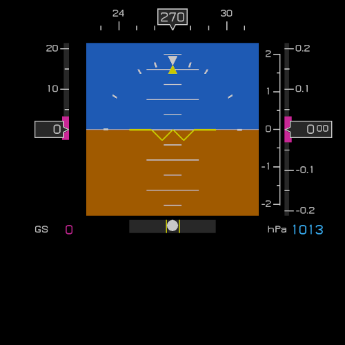

# Attitude

An implementation of aircraft glass cockpit display in [PyGame](https://www.pygame.org/)                                                     

### Inspiration                                                                                                   

The inspiration to undertake this project comes from the need for real looking instruments to complement my Flight Simulator Cockpit (sorry, still no pictures or any form of public display of the project itself).                 

I intend to build this simulator chair as generic as possible, in the sense that it won't be based on any particular aircraft model and, its flight controls should work as a standard joystick (HID) device. My current flight simulation software is [FlightGear](https://www.flightgear.org/), but I'm be confident it should be easily adaptable to other simulation platforms.                 

### Description                                                                                                   

Attitude is a graphical display that shows in-flight parameters on screen in a more modern way classical "steam" gauges used to present to the pilot. This graphical display can be imported from a script that reads flight parameters from a simulation software through the network, to show them in real time.                             

It could also be used to make a "real-deal" avionics project by reading parameters from real sensors, if you're willing to certify it under Civil Aviation Authority, however, my purpose is simulation.                           

If you're brave enough as to pursue such a project, I, THE AUTHOR WILL BE NO RESPONSIBLE FOR ANY DAMAGE, LOSS OF PROPERTY OR BUSINESS, OR ANY OTHER NEGATIVE OUTCOME AS A RESULT OF THE INCLUSION OF THIS PROJECT IN ANY EXTERNAL PROJECT.                                                                          

### Current features (as of Jun 2022)                                                                                                                                                                      
* Attitude indicator
* ASI (Air Speed Indicator) 
* VSI (Vertical Speed Indicator) 
* ALT (Altimeter)
* Side Slip Indicator
* Compass

The old "six-pack" needed for VFR flight, now on a screen, called Primary Flight Display (PFD).

### Future of Attitude

I intend to add navigation information, specifically, an HSI (Horizontal Situation Indicator) that supports VOR, NDB, and possibly the input of a flight plan. Honestly, right now I don't know yet how to read this information from the simulator, so I'm more focussed on the first part, above mentioned under Current Features.

Stay Tuned!!

Copyright 2022, Heli Barrocas <helinet*AT*gmail.com>  
